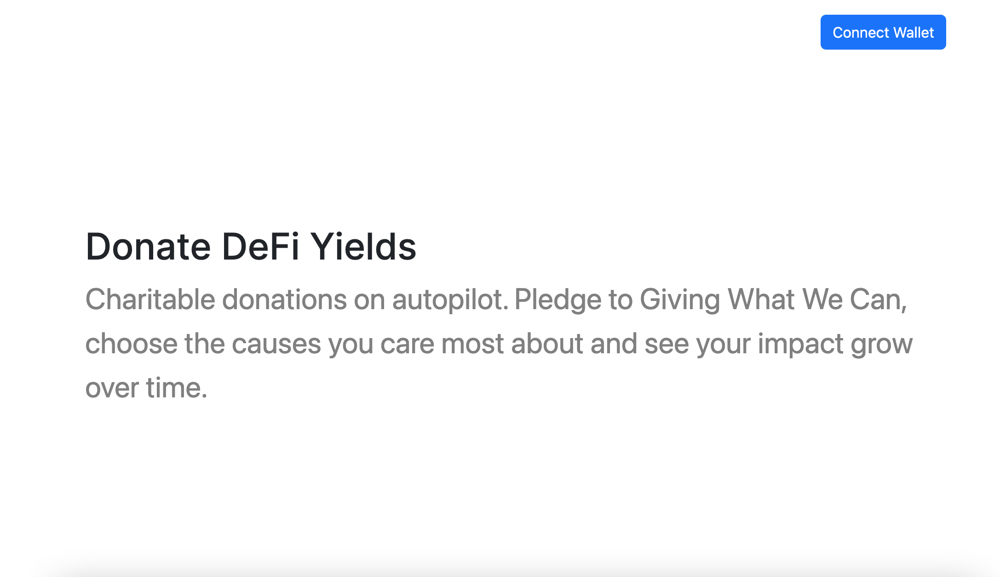
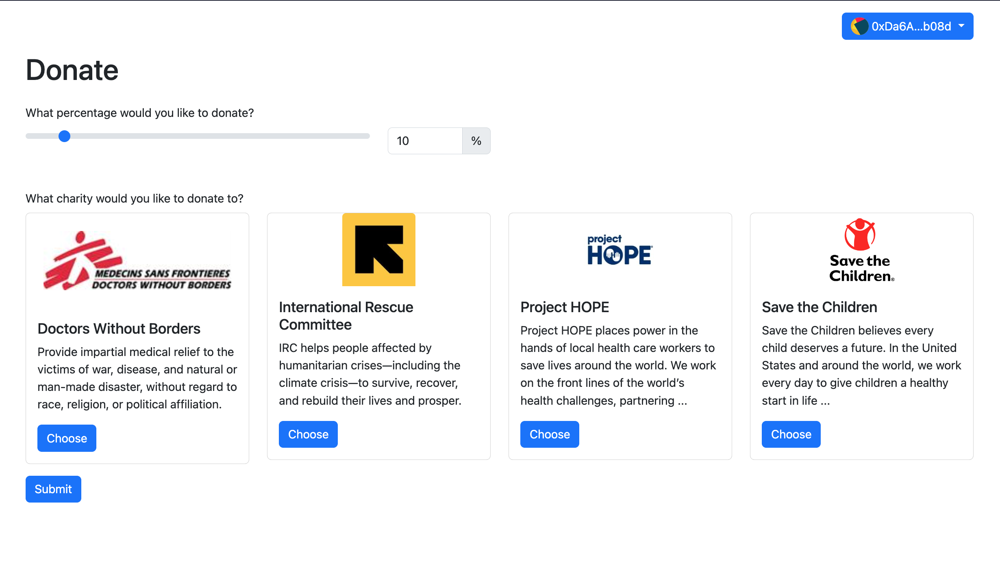
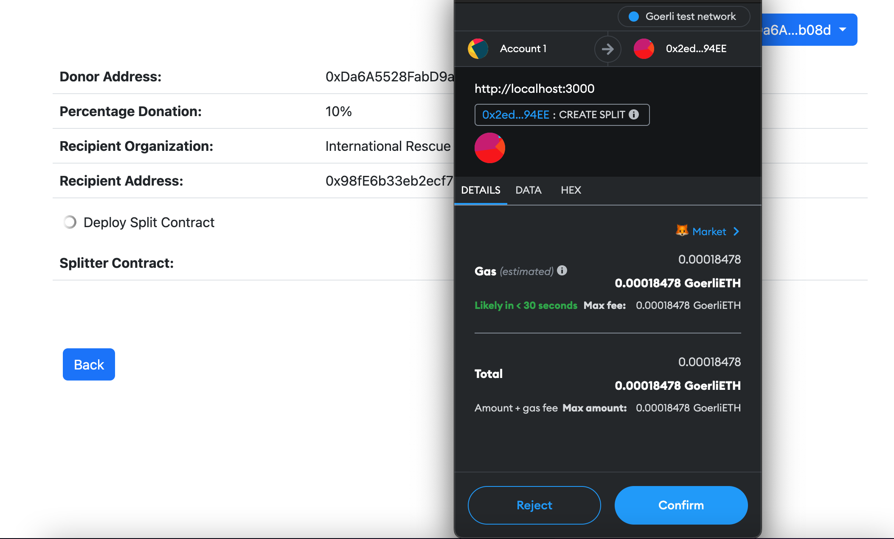
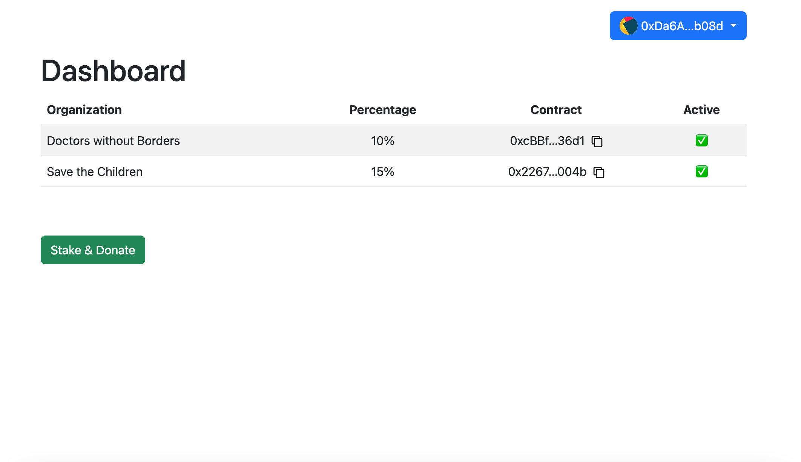

*Note: this repository was set up as an entry to ethDenver 2023 in the Public Goods category*

# AltruETH

AltruETH enables Ethereum users earning on-chain passive income (ETH2.0 staking and DeFi yield) to automatically donate a percentage of their income to charitable organizations of their choice. AltruETH aims to allow users to do good and feel good by providing an intuitive user interface and removing much of the friction that exists today in periodically making charitable donations to a variety of non-profit organizations and initiatives.

## ❤️ About

AltruETH is an initiative at the intersection of philanthropy, crypto-economic incentive structures and decentralized governance. 
Inspired by Giving What We Can (GWWC), AltruETH aims to make it easy for crypto holders to donate a portion of on-chain income (Ethereum staking reward, DeFi yield etc.) to causes that they care about. AltruETH enables Ethereum users earning passive income (ETH stakers and DeFi users) to automatically donate a percentage of their income to charitable organizations (AltruETH partners) of their choice. 

AltruETH ecosystem is made up from the following ecosystem participants: 

- Donors who pledge to provide a percentage of their on-chain income to charities of their choice
- Charitable organizations that receive donations
- Contributors to AltruETH, who further the mission of effective giving

AltruETH aims to create a social and interactive layer to giving:

- Greater contributions are encouraged by providing on-chain social recognition through mechanisms like Soulbound tokens (i.e. non-transferable NFTs) and greater governance power to larger donors.

- Donors create donation portfolios and share it with AltruETH community, community can follow influencer and discover effective causes to donate to

## 📂 Roadmap

AltruETH is planned to initially launch with a manifesto that defines the mission statement and the values of the DAO with a list of initial partners (i.e. climate change, open source code etc.). Over time, AltruETH takes a fully decentralized structure where contributors will have the ability to propose recipient organizations that are aligned with the mission statement of AltruETH.

AltruETH is also designed to be an open source project and we aim that it can be forked to allow local communities to create their own coordination mechanisms. An open question that we would like to address in this process is ways in which composability can be created between different DAOs that support the larger overall mission. One of the objectives of AltruETH is to experiment and assess different types of on-chain governance models.

## 💻 WebApp

An alpha version of the AltruETH app is available online at https://altrueth.vercel.app for anyone to test and provide feedback. Give it a try!


  
 

  

  


## 🛠 Architecture

This is a [Next.js](https://nextjs.org/) project bootstrapped with [`create-next-app`](https://github.com/vercel/next.js/tree/canary/packages/create-next-app).

### Getting Started

First, run the development server:

```bash
npm run dev
# or
yarn dev
# or
pnpm dev
```

Open [http://localhost:3000](http://localhost:3000) with your browser to see the result.

You can start editing the page by modifying `pages/index.js`. The page auto-updates as you edit the file.

[API routes](https://nextjs.org/docs/api-routes/introduction) can be accessed on [http://localhost:3000/api/hello](http://localhost:3000/api/hello). This endpoint can be edited in `pages/api/hello.js`.

The `pages/api` directory is mapped to `/api/*`. Files in this directory are treated as [API routes](https://nextjs.org/docs/api-routes/introduction) instead of React pages.

This project uses [`next/font`](https://nextjs.org/docs/basic-features/font-optimization) to automatically optimize and load Inter, a custom Google Font.

### Deploy on Vercel

The easiest way to deploy your Next.js app is to use the [Vercel Platform](https://vercel.com/new?utm_medium=default-template&filter=next.js&utm_source=create-next-app&utm_campaign=create-next-app-readme) from the creators of Next.js.

Check out our [Next.js deployment documentation](https://nextjs.org/docs/deployment) for more details.

This project is currently deployed on Vercel at https://altrueth.vercel.app

## 📝 License

This software is licensed under the [MIT License](LICENSE).

```
MIT License

Copyright (c) 2023 AltruETH

Permission is hereby granted, free of charge, to any person obtaining a copy
of this software and associated documentation files (the "Software"), to deal
in the Software without restriction, including without limitation the rights
to use, copy, modify, merge, publish, distribute, sublicense, and/or sell
copies of the Software, and to permit persons to whom the Software is
furnished to do so, subject to the following conditions:

The above copyright notice and this permission notice shall be included in all
copies or substantial portions of the Software.

THE SOFTWARE IS PROVIDED "AS IS", WITHOUT WARRANTY OF ANY KIND, EXPRESS OR
IMPLIED, INCLUDING BUT NOT LIMITED TO THE WARRANTIES OF MERCHANTABILITY,
FITNESS FOR A PARTICULAR PURPOSE AND NONINFRINGEMENT. IN NO EVENT SHALL THE
AUTHORS OR COPYRIGHT HOLDERS BE LIABLE FOR ANY CLAIM, DAMAGES OR OTHER
LIABILITY, WHETHER IN AN ACTION OF CONTRACT, TORT OR OTHERWISE, ARISING FROM,
OUT OF OR IN CONNECTION WITH THE SOFTWARE OR THE USE OR OTHER DEALINGS IN THE
SOFTWARE.
```
